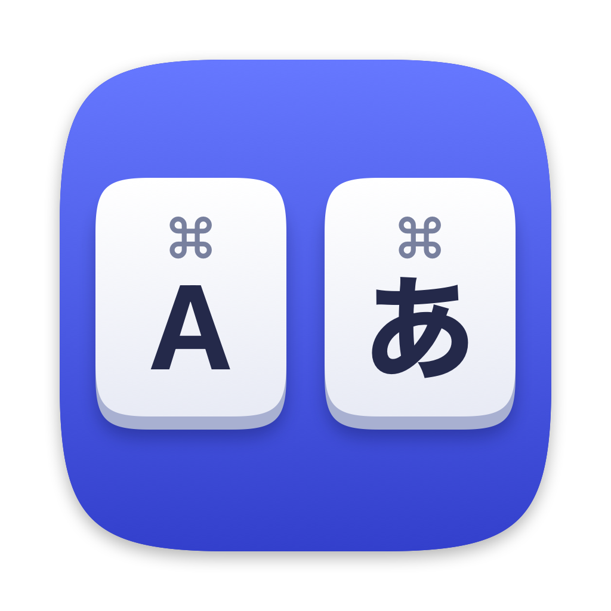

<p align="center">
  
</p>

# EisuKana Switch

[English](README.en.md)

左右の ⌘ キーを単独で押すだけで、英数 / かな を切り替える macOS メニューバーアプリです。
US 配列などのキーボードで、JIS キーボードの「英数」「かな」キーと同じ操作ができます。

- 左 ⌘ → 英数
- 右 ⌘ → かな

⌘C などのショートカットや、⌘ + クリック、他の修飾キーとの同時押しでは切り替わりません。

## 動作環境

- macOS 14 Sonoma 以降
- Apple Silicon / Intel

## インストール

### Homebrew

```sh
brew install --cask HaruhikoMotokawa/tap/eisukana-switch
```

アップデートは `brew upgrade --cask eisukana-switch` で行えます。

### GitHub Releases

[Releases](https://github.com/HaruhikoMotokawa/eisukana-switch/releases) から zip または dmg をダウンロードし、`EisuKanaSwitch.app` を「アプリケーション」フォルダに入れてください。
Developer ID で署名し、Apple の公証を受けています。

## 初回の設定（入力監視とアクセシビリティの許可）

切り替えには、次の 2 つの許可が必要です。どちらかが未許可の間は切り替えません。

| 許可 | 用途 |
| --- | --- |
| 入力監視 | ⌘ キーが押されたことを知るため |
| アクセシビリティ | 「英数」「かな」キーを送って切り替えるため |

キー入力の内容を保存したり、送信したりすることはありません（ネットワーク通信も行いません）。

1. EisuKana Switch を初めて起動すると、macOS の確認ダイアログと、アプリの「許可が必要です」という案内が出ます
2. 案内の各行の「システム設定を開く…」から、**システム設定 > プライバシーとセキュリティ** の **入力監視** と **アクセシビリティ** で、それぞれ EisuKana Switch をオンにします
3. アプリの案内が「許可されました」に変われば完了です。アプリを再起動する必要はありません（macOS から「終了して再度開く」を勧められた場合は、「あとで」を選んでも動きます）

案内を閉じてしまった場合は、メニューバーのアイコンから「入力監視の設定を開く…」「アクセシビリティの設定を開く…」を選んでください。
一覧に EisuKana Switch が無いときは、「+」ボタンから `/Applications/EisuKanaSwitch.app` を追加します。

## 使い方

メニューバーのアイコンをクリックすると、次のメニューが出ます。Dock には表示されません。

| 項目 | 内容 |
| --- | --- |
| 有効 | オフにすると、⌘ を押しても切り替えなくなります |
| ログイン時に起動 | ログイン時に自動で起動します。「ログイン項目での許可が必要です」と出たら、システム設定 > 一般 > ログイン項目 で許可してください |
| EisuKana Switch について | バージョンなど |
| 終了 | アプリを終了します |

切り替えは、JIS キーボードの「英数」「かな」キーを押したときと同じです。どの入力ソースに切り替わるかは、使っている IME が決めます。
仕組みは [docs/input-source-switching.md](docs/input-source-switching.md) を参照してください。

## アンインストール

Homebrew で入れた場合は、設定ごと削除できます。

```sh
brew uninstall --zap --cask eisukana-switch
```

手動で入れた場合は、アプリを終了してから `/Applications/EisuKanaSwitch.app` を削除してください。
システム設定 > プライバシーとセキュリティ の 入力監視 と アクセシビリティ に残った項目は、「−」ボタンで消せます。

## 開発

### 必要なもの

- Xcode 26.0.1（CI と同じバージョン）
- macOS 14 以降

### ビルドと実行

```sh
git clone https://github.com/HaruhikoMotokawa/eisukana-switch.git
cd eisukana-switch
open EisuKanaSwitch.xcodeproj
```

1. ターゲット EisuKanaSwitch の Signing & Capabilities で、Team を自分のものにします（個人の Apple ID でも構いません）
2. スキーム EisuKanaSwitch を選び、⌘R で実行します

入力監視とアクセシビリティの許可は、アプリの署名に結び付きます。ad-hoc 署名など、署名の違うビルドを動かしたあとは、
システム設定でオンになっていても許可が効かないことがあります。そのときは記録を消して、許可し直してください。

```sh
tccutil reset ListenEvent io.github.haruhikomotokawa.EisuKanaSwitch
tccutil reset Accessibility io.github.haruhikomotokawa.EisuKanaSwitch
tccutil reset PostEvent io.github.haruhikomotokawa.EisuKanaSwitch
```

詳しくは [docs/input-source-switching.md](docs/input-source-switching.md) を参照してください。

### テスト

```sh
xcodebuild test \
  -project EisuKanaSwitch.xcodeproj \
  -scheme EisuKanaSwitch \
  -destination 'platform=macOS' \
  CODE_SIGN_IDENTITY=- \
  CODE_SIGNING_REQUIRED=NO
```

### ドキュメント

- [要求定義](docs/requirements.md)
- [Spike #1: App Sandbox 下でのキー検出・入力ソース切り替え](docs/spike-1-sandbox.md)
- [入力ソースの切り替え（英数 / かな）](docs/input-source-switching.md)
- [リリース手順](docs/release.md)

## 謝辞

このアプリは [⌘英かな (iMasanari/cmd-eikana)](https://github.com/iMasanari/cmd-eikana)（MIT License）に着想を得ています。

## ライセンス

[MIT](LICENSE)
